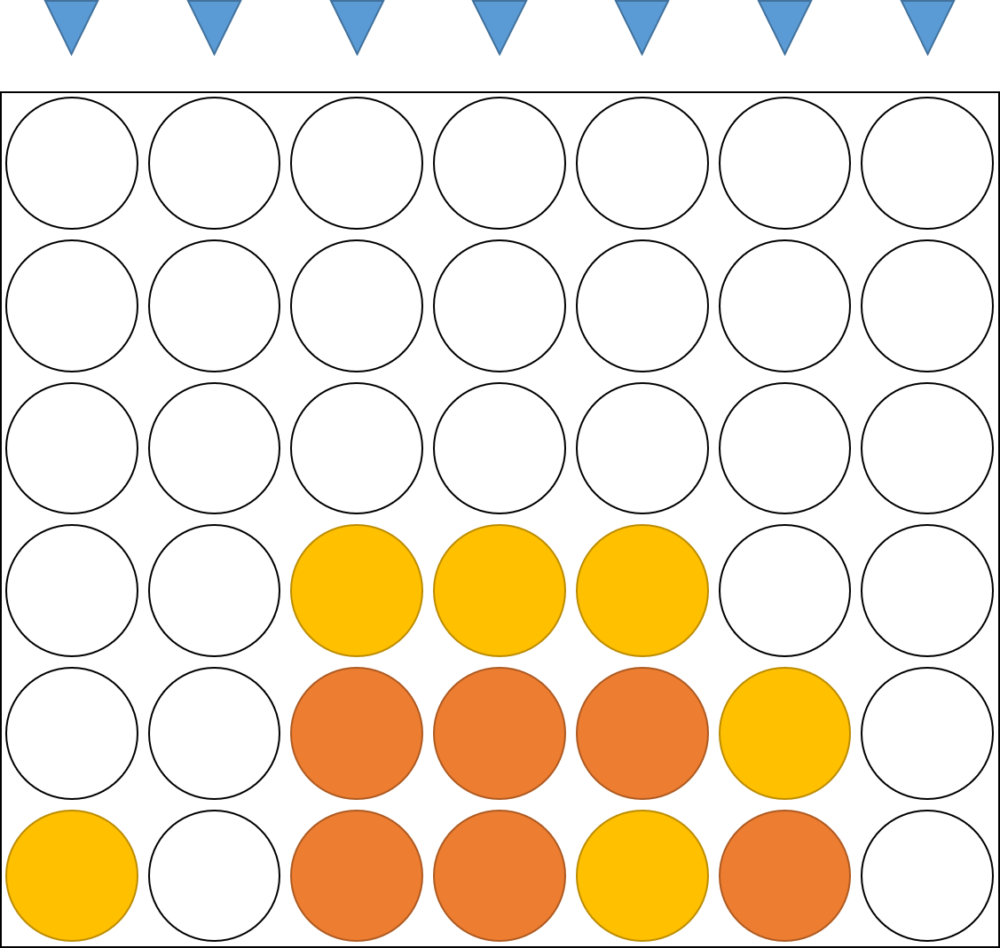

# Connect Four

 
(画像は[任天堂公式サイト](https://www.nintendo.co.jp/switch/as7ta/games/)から引用)  

## 概要
- Nintendo Switch 『世界のアソビ大全51』に収録されている『コネクトフォー』をJavaで再現します。

## ルール
- コマを落として、先に縦または横または斜めに4つ並べたプレイヤーが勝ち。
- 重力つき四目並べとも言う。

## Nintendoの[公式紹介動画](https://www.youtube.com/watch?v=n4mNFfT2uhs&)より
 
:boy: 「どっちが先に4つ並べられるかな？」  
 
 
:boy: 「はい」  
 
 
:girl: 「はい」  
 
 
:boy: 「はい」  
 
 
:girl: 「はい」  
 
 
:boy: 「はい」  
 
 
:girl: 「やった～、リーチ♪」  
 
 
:boy: 「はい、ボクの勝ち」  
:girl: 「あ～見逃してた～ !!」 
  
  
 

<h2>これが</h2>
<h1>
コネクトフォー</h1>

